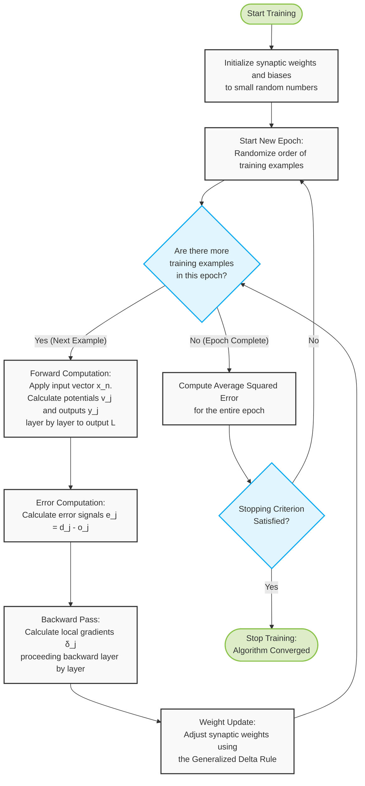

# Backpropagation Algorithm

6. Repeat 4 and 5 for all layers including the output layer.
	The output of the network is the outputs of the neurons in the output layer  $(l=L):y_{j}^{(L)}(n)=o_{j}(n)$

**Error Computation and Weight Update**
7. Compute the Error Signals: $e_{j}(n)=d_{j}(n)-o_{j}(n)$
    * where $d_{j}(n)$ is the $j$th element of the desired response vector $d(n)$.
    * Compute the sum of squared errors of the network: $\mathcal{E}(n)=\frac{1}{2}\sum_{j\in C}e_{j}^{2}(n)$
8. Calculate the local gradient $\delta_{j}$, of the network by proceeding backward layer by layer:
    * $\delta_{j}^{(L)}=e_{j}^{(L)}(n)o_{j}(n)[1-o_{j}(n)]$ for neurons in the output layer L
    * $\delta_{j}^{(l)}=y_{j}^{(l)}(n)[1-y_{j}^{(l)}(n)]\sum_{k}\delta_{k}^{(l+1)}(n)w_{kj}^{(l+1)}(n)$ for neurons in the hidden layer l
9. Adjust the synaptic weights of the network according to the Generalized Delta Rule:
    * $w_{ji}^{(l)}(n+1)=w_{ji}^{(l)}(n)+\alpha[\Delta w_{ji}^{(l)}(n-1)]+\eta\delta_{j}^{(l)}(n)y_{i}^{(l-1)}(n)$
    * compute first the $\delta$'s of layer $(l-1)$ before updating the weights in layer $l$
10. Repeat steps 3 to 10 for all training examples in the training set.

Compute the average squared error for the epoch:
$\mathcal{E}_{av}=\frac{1}{N}\sum_{n=1}^{N}\mathcal{E}(n)$
where N is the number of training examples. Stop training when the selected stopping criterion is satisfied.
Order of presentation of training examples from epoch to epoch must be randomized.

30/39

# Supplemental: Backpropagation Algorithm Flowchart (Slides 29-30)

### How to read this flowchart alongside the slides:

1. **Initialization:** Corresponds to Steps 1-2 on Slide 29. The network is configured and initialized with random weights.
2. **Epoch Loop:** Corresponds to Step 3. An epoch consists of passing all training examples through the network. The order is randomized at the start of each new epoch.
3. **Forward Computation:** Corresponds to Steps 4-6. The inputs ripple forward until the final output predictions ($o_j$) are made.
4. **Error & Backward Pass:** Corresponds to Steps 7-8. The error is calculated, and the local gradients ($\delta_j$) are pushed backward through the network.
5. **Weight Update:** Corresponds to Step 9. The weights are adjusted based on the calculated deltas.
6. **Stopping Criteria:** Corresponds to the final steps on Slide 30. Once all examples in the epoch are processed, the average error is checked. If it's small enough, training stops; otherwise, a new epoch begins.
---
**Navigation**
[[L7B-Slide-29|Previous ← Backpropagation Algorithm Steps 1-3]]
[[AI 201 - Artificial Intelligence/Lecture 7B Backpropagation/L7B-0-Table-of-Contents|↑ Lecture 7B TOC]]
[[L7B-Slide-31|Next → Heuristics (Activation & Target)]]